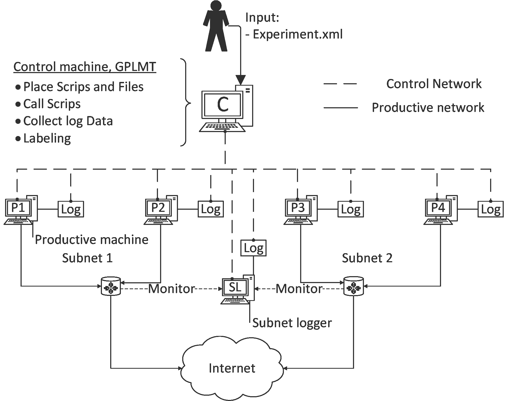
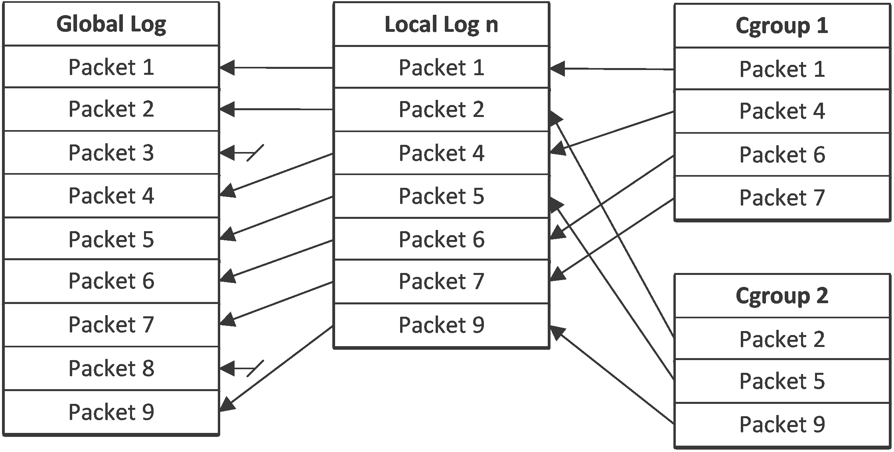

# Linux Logging Tool

This tool offers Linux traffic capturing and creation of a keyfile that holds the information to which process/script each packet belongs.

This project can be used in conjunction with [GPLMT](https://github.com/docmalloc/gplmt). The given examples use GPLMT for deployment and execution.

Dependencies:
=============

These are the direct dependencies for running the framework:

- Python >= 3.5.1

- scapy-python3 >= 0.18

- Linux Kernel >= 3.14

- iptables >= 1.6.0

- libnftnl library

- Dumpcap >= 2.0.2

The version numbers represent the versions we used at development.

Content
=============

scripts/
Scripts for dataset creation, subdivided into logging attacks and traffic

tasklists/
gplmt tasklists needed to call the scripts

experiments/
gplmt experiment XML files

results/
Output folder for results

targets/
gplmt target definition XML files

docs/
Documentation sources (e.g. pictures)

How to install?
===============

Python
--------

Check http://www.python.org/ how to setup Python for your OS

To install the required python3 modules, we recommend using the pip3 
installer:

http://www.pip-installer.org/en/latest/index.html

scapy-python3 >= 0.18
--------

On GNU/Linux use: `sudo pip3 install scapy-python3`
or check https://github.com/phaethon/scapy

Dumpcap
--------

On Ubuntu use: `sudo apt-get install wireshark-common`

The Framework
===============

Functionality
--------

To create datasets we log at two different positions inside the network. At first we have a local logging on all participating productive machines. With this local labeling the packet <--> process information are stored.

The global logging takes place on a machine that is able to log all packets that traverse a subnet. We used a machine that uses a monitoring port to the software switch of our virtual environment.

In the labeling process at the end of the experiment for every packet in the global dump the corresponding packets in the local dumps are matched and the process information are stored in the keyfile. The labeling takes place on the control machine

Experiments
--------
An experiment is defined as the creation of a dataset. This creation is subdivided into three steps.

At first the preparation phase is executed. Within this step all required files are transferred to the hosts and some adjustments are done.

The second stage is the execution in which the actual capturing takes place. The productive machines create traffic and perform their attacks.

The last step is the postprocessing which contains the collection of all dumpfiles followed by the labeling that creates the keyfile. In addition all temporary files on the hosts are deleted and the standard settings are restored.

Local logging
--------
To obtain the process information for each packet in the local labeling we use Linux cgroups in conjunction with iptables, nflog and dumpcap.

At first we create a cgroup for every new process and execute it inside the cgroup. Then we use the iptables cgroup matching to mark the connections with its cgroup ID. For every ID we then move the marked traffic to one nflog group. At the end we capture the traffic of these nfloggroups and gain a dump in which the ethernet header is replaced by a nflog header. This header contains the ID by which we can identify the corresponding cgroup. Since we also stored which processes are executed inside the cgroups we can create the correlation of packets and processes.     

Labeling
--------
The labeling takes the global dumpfile, the local dumpfiles and the cgroupID files as input. For every packet in the global dump the corresponding packets in the local dumps are searched. For the matching the packet data of layer three and above are used. Layer two cannot be used since in the local dumpfiles the ethernet header is replaced by the nflog header. If a match is found the information for the packets cgroup that are stored in the cgroupID file are transferred to the keyfile.

Keyfile
--------

This wonderful readme is to be continued ... :shipit: